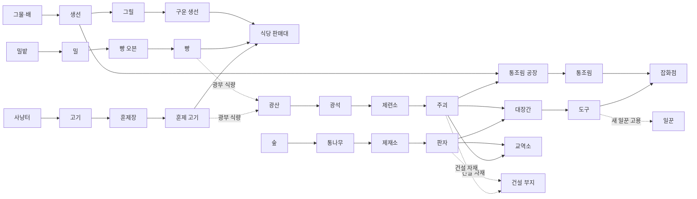

# 서리마을 개척기 — 확장 기획 v2~v4 (쉬운 조작 + 세틀러의 좋은 점)

> 원칙: 지금처럼 **걷고·나르고·발판 밟는 쉬운 조작**은 그대로. 세틀러의 좋은 점만 가져온다.
> ① 길 위로 물건을 나르는 짐꾼 ② 줄줄이 이어지는 생산 사슬 ③ 도구가 있어야 새 직업 ④ 광산은 음식이 있어야 돌아감
> ⑤ 망루를 세우면 땅이 넓어짐 ⑥ (가볍게) 빈 땅에 원하는 건물을 골라 짓기 — 짐꾼이 자재를 날라와 지어지는 모습
> 큰 목표: 끝나지 않는 겨울에 **봄의 등불**을 밝히는 것 (1챕터 엔딩, v4)

## v2 — 살아 있는 마을
| 기능 | 내용 |
|---|---|
| 주민 생활 | 주민 17명 + 새 주민 12명 + 동물 3마리. 수다(말풍선), 눈싸움, 술래잡기, 모닥불 공연과 춤, 벤치 낮잠, 눈사람 만들기, 촌장에게 손 흔들기, 해금 축하, 터치하면 반응 (`docs/주민기획.md`) |
| 인구 성장 | 시작 주민 4명 → 구역을 열 때마다 2~3명 이사("새 주민 ○○ 이사 왔어요!"). 손님도 주민 중에서 다양하게 |
| 지도 확대·축소 | 두 손가락 핀치, PC 마우스 휠, 화면의 +/- 버튼, "전체 보기" 버튼 |
| 가게 점원 | 판매대·교역소에 **계산대**가 생김. 처음엔 촌장이 계산대 옆에 서 있어야 손님이 계산하고 떠남 → **점원 고용**하면 자동 계산 (장르 표준 재미) |
| 가게 짐꾼 | 생산 라인마다 **짐꾼 고용** 발판: 가공소 출구 → **길을 따라** → 가게 진열대로 자동 배달. 등에 물건을 탑처럼 지고 걸어감 |
| 길 | 구역 사이에 길이 있고, 짐꾼·일꾼·손님이 길 위로 다님 (구역을 열면 길이 이어짐) |
| 다듬기 | 숲에서 나무 뒤에 캐릭터가 가려지는 문제 해결 |

## v3 — 생산 사슬과 땅 넓히기
| 기능 | 내용 |
|---|---|
| 망루 | 마을 가장자리 **망루 발판**(코인 + 판자) → 망루가 세워지고 불이 켜지면 **눈안개가 걷히며 새 땅** |
| 빈 건설 부지 | 새 땅에 빈 부지 여러 곳. 부지에 서면 **건설 메뉴**에서 원하는 건물을 고름 (창고, 통조림 공장, 잡화점, 대장간, 집, 추가 가공소 등) |
| 공사 | 고르면 **기초 → 비계 → 완성** 단계로 지어짐. 필요한 자재(판자·주괴)를 **짐꾼들이 길로 날라옴** (촌장이 직접 날라도 됨) |
| 대장간 | **주괴 + 판자 → 도구**(도끼·곡괭이·낚싯대·낫·활). 두 번째 일꾼과 배 선원을 고용하려면 **도구가 필요** |
| 통조림 공장 | **생선 3 + 주괴 1 → 통조림 3** → 새 가게 **잡화점**에서 판매 (잡화점도 점원·짐꾼) |
| 광산 식량 | 광부는 **빵이나 훈제 고기를 먹어야** 캠. 광산 식량 상자가 비면 광부가 쉬며 🍞 이모티콘 → 사슬끼리 연결됨 |
| 창고 | 가공소 출구가 꽉 차도 짐꾼이 창고로 옮겨 생산이 멈추지 않음. 가게가 비면 창고에서 꺼내 채움 |
| 배 어업 | 부두에서 **나룻배 구매** → 어부가 배 타고 바다로 나가 큰 물고기(참치)를 잡아옴 → 어선으로 업그레이드 |
| 집 | 집을 지으면 **주민 수 상한**이 늘어 새 주민이 이사 옴 |

### 생산 사슬 한눈에

## v4 — 성장과 봄
- **건물 업그레이드 Lv1~3**: 모습이 바뀌고(나무 → 돌 → 굴뚝 공장), 속도·저장량·직원 칸 증가
- **주민 욕구와 행복도**: 음식 다양성·생활용품(통조림·도구)·즐거움(공연·스케이트장) → 행복하면 손님·팁·새 주민 증가
- **봄의 등불**: 망루를 모두 세우고 주요 건물을 완성하면 광장의 등불 점화 → **눈이 녹고 봄이 오는 연출** (1챕터 엔딩)
- **주민 도감**: 이사 온 주민을 모으는 수집 요소

## 만드는 순서
1. v2 그림·소리(새 주민 12명, 대화 소리 등) + v2 코드 동시 진행 → 테스트 링크
2. v3 그림(새 건물·공사 단계·배·도구·길·눈안개) 동시 제작 → v3 코드 → 테스트 링크
3. v4 → 검수 → 수정 → 테스트 링크
